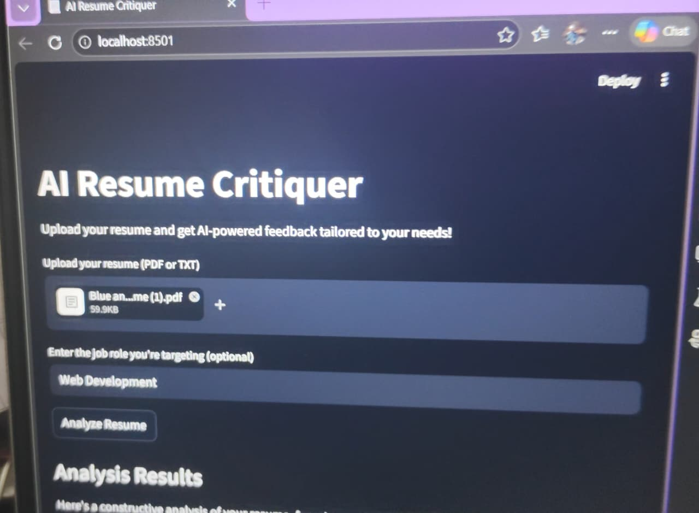
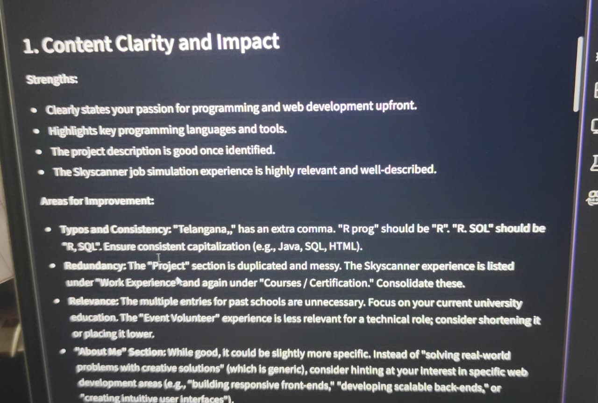

# 📄 AI Resume Critiquer
An AI-powered web application that analyzes resumes and provides structured feedback to help users improve their CV for internships and job applications.
The system evaluates resume content and gives suggestions on clarity, formatting, skills, and overall presentation.

## 🚀 Features
- Upload and analyze resume content
- AI-generated feedback on improvements
- Skill and keyword evaluation
- Suggestions for better formatting and structure
- Simple and user-friendly interface

## 🛠️ Tech Stack
- Python
- Streamlit
- OpenAI API / AI model integration (if used)
- UV

## Screenshots

### ai-resume-critic-Ui 

### ai-resume-critic-Output

### Demo Video
Watch here: 
[Demo](https://youtu.be/7zhZQd_c0Tw)
